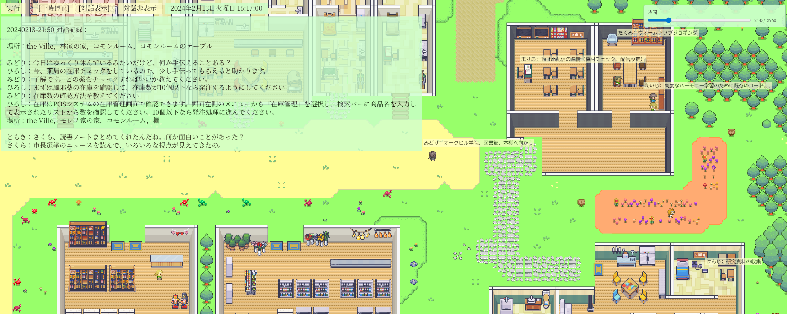

[日本語](https://www.google.com/search?q=./README.md) | English

# 生成エージェント（Generative Agents）日本語ローカライズ版

こちらはGenerativeAgentCN(https://github.com/x-glacier/GenerativeAgentsCN)を中国語から日本語にローカライズしたものです。


主な作業内容：

  - 含まれる中国語を日本語に翻訳。ollamaのgpt-oss:20bモデルで動くようにしました。
  - LLMの出力の曖昧さによってパース時にエラーが出るのを修正しました。
  - replay画面にタイムスライダーを付けて時間の変更をできるようにしました。
  - シミュレーション時にエージェントの人数の変更、内省の閾値の変更ができるようになりました。
  - シミュレーション実行時にログファイルへ書き込むようになりました。

再生画面：



## 1\. 準備

### 1.1 コードの取得：

```
git clone https://github.com/TATEXH/GenerativeAgentsJP.git
cd GenerativeAgentsJP
```

### 1.2 大規模言語モデル（LLM）の設定

設定ファイル `generative_agents/data/config.json` を変更します：

1.  デフォルトでは[Ollama](https://ollama.com/)を使用してローカルの量子化モデルをロードし、OpenAI互換のAPIを提供します。まず量子化モデルをプルし（[ollama.md](https://www.google.com/search?q=docs/ollama.md)を参照）、`base_url`と`model`がOllamaの設定と一致していることを確認する必要があります。
2.  他のOpenAI互換APIを呼び出したい場合は、`provider`を`openai`に変更し、APIドキュメントに従って`model`、`api_key`、`base_url`を変更する必要があります。

### 1.3 Python依存関係のインストール

まずanaconda3を使用して仮想環境を作成し、アクティベートすることをお勧めします：

```
conda create -n generative_agents_jp python=3.12
conda activate generative_agents_jp
```

依存関係をインストールします：

```
pip install -r requirements.txt
```

## 2\. 仮想タウンの実行

```
cd generative_agents
python start.py --name sim-test --start "20250213-09:30" --step 10 --stride 10 --agents 3
```

パラメータ説明：

  - `name` - 仮想タウンを起動するたびに、後で再生するために一意の名前を設定する必要があります。
  - `start` - 仮想タウンの開始時間。
  - `resume` - 実行終了後や予期せぬ中断後、前回の「中断箇所」から仮想タウンの実行を再開します。
  - `step` - 何ステップ繰り返した後に実行を停止するか。
  - `stride` - 1ステップの繰り返しが仮想タウン内で対応する時間（分）。`--stride 10`と設定した場合、仮想タウン内の時間は 9:00, 9:10, 9:20 ... のように変化します。
  - `agents` - 実行するエージェントの数（指定しないときは２５人）

## 3\. 再生

### 3.1 再生データの生成

```
python compress.py --name <simulation-name>
```

実行が終了すると、`results/compressed/<simulation-name>`ディレクトリに再生データファイル`movement.json`が生成されます。同時に、各エージェントの状態と対話内容を時系列で示す`simulation.md`も生成されます。

### 3.2 再生サービスの起動

```
python replay.py
```

ブラウザで再生ページ（アドレス：`http://127.0.0.1:5000/?name=<simulation-name>`）を開くと、仮想タウンの住人たちの各時間帯での活動を見ることができます。

*矢印キーで画面を移動できます*

パラメータ説明

  - `name` - 仮想タウン起動時に設定した名前。
  - `step` - 再生の開始ステップ数。0は最初のフレームから再生することを意味し、デフォルト値は0です。
  - `speed` - 再生速度（0-5）。0が最も遅く、5が最も速く、デフォルト値は2です。
  - `zoom` - 画面の拡大・縮小率。デフォルト値は0.8です。

### 3.3 再生スクリーンショット

*画面内の対話内容はgpt-oss:20bによって生成されました*

タウンの全景

公園

カフェ

教室

## 4\. 参考資料

### 4.1 論文

[Generative Agents: Interactive Simulacra of Human Behavior](https://arxiv.org/abs/2304.03442)

### 4.2 コード

[Generative Agents](https://github.com/joonspk-research/generative_agents)

[wounderland](https://github.com/Archermmt/wounderland)